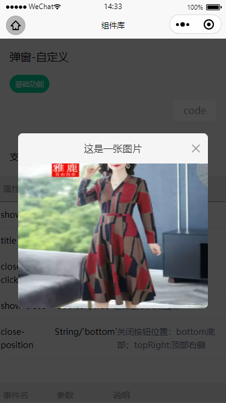

## 弹窗—自定义

（1）弹窗内容通过插槽完全自定义 <br/>
（2）带右侧/底部 X关闭按钮功能

<div style="display:inline-block">
  
  <div style="float:left; margin:160px 0 0 100px">
  联系李凌云加体验权限
  <br />
  
  </div>
</div>

### 代码用法 

```js
"usingComponents": {
  "gd-custom-dialog": "@gd/weui/gd-custom-dialog/gd-custom-dialog"
}
```

```html
<gd-custom-dialog show="{{show}}" bind:close="onClose" title='这是一张图片' close-position="topRight">
  <view style="font-size:0px">
    <image src="./images/a.jpg" />
  </view>
</gd-custom-dialog>
```
```css
.gd-dialog-title{
  background:#f5f5f5
}
```
```javascript
Page({
  data: {
    show: false
  },
  onClose() {
    this.setData({
      show: false
    })
  },
  ...
})
```

### Attributes

| 参数      | 说明            | 类型      | 必须 | 可选值                           | 默认值    |
| --------- | -------------- | -------- | --- | -------------------------------- | -------- |
| show | 是否显示 | Boolean | ✔ | - | false |
| title | 标题文案 | String | - | - | '' |
| close-on-click-overlay | 点击遮罩层时是否关闭弹窗 | Boolean | - | - | true |
| show-close | 是否显示关闭图标 | Boolean | - | - | true |
| close-position | 关闭按钮位置 | String | - | bottom:底部；topRight:顶部右侧 | 'bottom' |

### Events

| 事件名称 | 说明           | 回调参数 |
| -------- | -------------- | -------- |
| close     | 点击底部关闭图标回调函数 | - |

### Slot

| name    | 说明     |
| ------ | -------- |
| - | 默认插槽，弹窗内容 |


请阅读下一节：[快速上手](/start/quickstart)。


<FooterGd/>