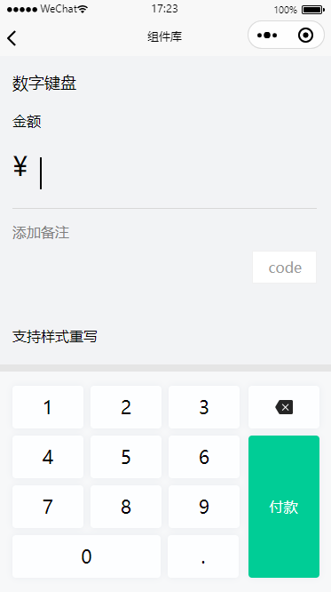

## 数字键盘

数字键盘<br/>

<div style="display:inline-block">

<div style="float:left; margin:160px 0 0 100px">
联系李凌云加体验权限
<br />

</div>
</div>


### 代码用法 

```js
"usingComponents": {
  "gd-digit-keyboard": "@gd/weui/gd-digit-keyboard/gd-digit-keyboard",
}
```
```html
<view class="keyboard-input">
  <view>
    <text class="name">金额</text>
    <view class="money-warp" bindtap="onMoneyFocus">
      <text class="unit">¥</text>
      <text class="money">{{money}}</text>
      <view wx:if="{{cursorShow}}" class="cursor"></view>
    </view>
    <input placeholder="添加备注" bindfocus="onInputFocus" bindinput="onInputFeild" data-name="remarks" maxlength="30" class="remarks" adjust-position="false" />
  </view>
</view>
<gd-digit-keyboard value="{{money}}" bind:change="change" bind:done="done" confirmButtonDisabled="{{keyboardSureDisabled}}" />
```
```css
.keyboard-input {
  position: relative;
}
.money-warp {
  padding: 40rpx 0 30rpx;
  border-bottom: 1px solid rgba(216, 216, 216, 1);
  position: relative;
}

.money-warp .cursor {
  display: inline-block;
  width: 2px;
  height: 36px;
  animation: blink 1s infinite steps(1, start);
  margin-left: 6rpx;
}
@keyframes blink {
  0% {
    background-color: transparent;
  }
  50% {
    background-color: #000;
  }
  100% {
    background-color: transparent;
  }
}

.unit {
  font-size: 60rpx;
  line-height: 60rpx;
  position: relative;
  top: -30rpx;
}

.money {
  font-size: 100rpx;
  line-height: 100rpx;
  margin-left: 20rpx;
}
.remarks {
  margin-top: 30rpx;
}
```
```javascript
Page({  
  data: {
    show: true,
    money: '',
    keyboardSureDisabled: false,
    cursorShow: true
  },
  onMoneyFocus() {
    if (!this.data.cursorShow) {
      this.setData({
        cursorShow: true,
        show: true
      })
    }
  },
  change(e) {
    this.setData({
      money: e.detail
    })
    this.onMoneyFocus()
  },
  done() {
    Toast('去付款：' + this.data.money)
  },
  onInputFocus() {
    if (this.data.cursorShow) {
      this.setData({
        cursorShow: false,
        show: false
      })
    }
  },
  ...
})
```
`


### Attributes

| 参数      | 说明            | 类型      | 必须 | 可选值                           | 默认值    |
| --------- | -------------- | -------- | --- | -------------------------------- | -------- |
| value | 值 | String | ✔ | - | '' |
| maxlength | 最大长度 | Number | - | - | 8 |
| decimal-length | 小数点位数 | Number | - | - | 2 |
| confirm-button-disabled | 确定按钮是否可点击 | Boolean | - | - | false |
| confirm-button-text | 确定按钮文案 | String | - | - | '付款' |

### Events

| 事件名称 | 说明           | 回调参数 |
| -------- | -------------- | -------- |
| change     | 值变更 | e.detail当前数据 |
| done     | 付款按钮回调 | - |

<FooterGd/>