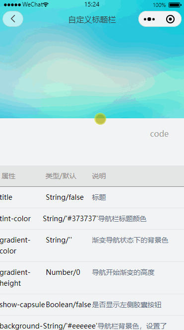

## 导航栏

### 贡献者

林熹

### 体验

<div style="display:inline-block;margin-top:30px">

<div style="float:left; margin:0px 0 0 100px">
联系李凌云加体验权限
<br />

</div>
</div>

### 代码用法

```js
"usingComponents": {
  "gd-navigation-bar": "../../components/gd-navigation-bar/gd-navigation-bar",
}
```

```html
<gd-navigation-bar
  id="app-header"
  gradient-color="#fff"
  gradient-height="{{10}}"
  show-capsule="{{true}}"
  title="自定义标题栏"
></gd-navigation-bar>
```

```javascript
Page({
  onLoad: function (options) {
    this.appHeader = this.selectComponent('#app-header')
  },

  onPageScroll({ scrollTop }) {
    this.appHeader.setOpacity(scrollTop)
  },
  ...
})
```

### Attributes

| 参数             | 说明                                       | 类型    | 必须 | 可选值 | 默认值    |
| ---------------- | ------------------------------------------ | ------- | ---- | ------ | --------- |
| title            | 标题                                       | String  | -    | -      | -         |
| tint-color       | 导航栏标题颜色                             | String  | -    | -      | '#373737' |
| gradient-color   | 渐变导航状态下的背景色                     | String  | -    | -      | -         |
| gradient-height  | 导航开始渐变的高度                         | Number  | -    | -      | 0         |
| show-capsule     | 是否显示左侧胶囊按钮                       | Boolean | -    | -      | false     |
| background-color | 导航栏背景色，设置了 gradient-color 则无效 | String  | -    | -      | '#eeeeee' |

## Slot

| name | 说明             |
| ---- | ---------------- |
| --   | 整个标题栏插槽   |
| left | 左侧胶囊按钮插槽 |

<FooterGd/>
