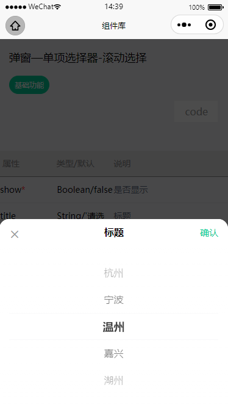

## 底部弹窗—选择器-滚动选择

底部弹窗滚动选择内容 <br/>

<div style="display:inline-block">

<div style="float:left; margin:160px 0 0 100px">
联系李凌云加体验权限
<br />

</div>
</div>


### 代码用法 

```js
"usingComponents": {
  "gd-popup-picker": "@gd/weui/gd-popup-picker/gd-popup-picker",
}
```

```html
<gd-popup-picker title="标题" show="{{show}}" columns="{{data}}" default-index="{{2}}" bind:confirm="onConfirm" />
```

```javascript
Page({
  data: {
    show: false,
    data: ['杭州', '宁波', '温州', '嘉兴', '湖州']
  },
  onTap1() {
    this.setData({
      show: true
    })
  },
  
  onConfirm(e) {
    // Toast(e.detail.value)
    this.setData({
      show: false
    })
  },
  ...
})
```

### Attributes

| 参数      | 说明            | 类型      | 必须 | 可选值                           | 默认值    |
| --------- | -------------- | -------- | --- | -------------------------------- | -------- |
| show | 是否显示 | Boolean | ✔ | - | false |
| title | 标题文案 | String | - | - | '请选择' |
| columns | 数据源，参见https://vant-contrib.gitee.io/vant-weapp/#/picker#columns-shu-ju-jie-gou | Array | ✔ | - | [] |
| default-index | 默认选择项索引 | Number | - | - | 0 |

### Events

| 事件名称 | 说明           | 回调参数 |
| -------- | -------------- | -------- |
| confirm     | 点击确定执行函数返回结果 | e.detail当前数据 |


<FooterGd/>