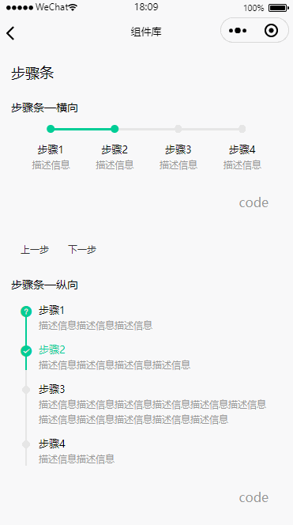

## 步骤条

### 贡献者

林熹

### 体验

<div style="display:inline-block;margin-top:30px">

<div style="float:left; margin:0px 0 0 100px">
联系李凌云加体验权限
<br />

</div>
</div>

### 代码用法

```js
"usingComponents": {
  "gd-steps": "../../components/gd-steps/gd-steps",
}
```

#### （1）横向

```html
<gd-steps
  steps="{{steps}}"
  direction="{{direction}}"
  active="{{active}}"
></gd-steps>
```

```javascript
Page({
  /**
   * 页面的初始数据
   */
  data: {
    steps: [
      { title: '步骤1', desc: '描述信息' },
      { title: '步骤2', desc: '描述信息' },
      { title: '步骤3', desc: '描述信息' },
      { title: '步骤4', desc: '描述信息' }
    ],
    direction: 'horizontal',
    active: 1
  },
  ...
})
```

#### （1）纵向

```html
<gd-steps
  steps="{{steps}}"
  activeIcon="{{activeIcon}}"
  finishIcon="{{finishIcon}}"
  direction="{{direction}}"
  active="{{active}}"
></gd-steps>
```

```javascript
Page({
  /**
   * 页面的初始数据
   */
  data: {
    steps: [
      { title: '步骤1', desc: '描述信息描述信息描述信息' },
      { title: '步骤2', desc: '描述信息描述信息描述信息描述信息', finishColor: '#FF3B30' },
      {
        title: '步骤3',
        desc:
          '描述信息描述信息描述信息描述信息描述信息描述信息描述信息描述信息描述信息描述信息描述信息'
      },
      { title: '步骤4', desc: '描述信息描述信息' }
    ],
    direction: 'vertical',
    finishIcon: 'question',
    activeIcon: 'checked',
    active: 2
  },
  ...
})
```

### Attributes

| 参数       | 说明                                                                | 类型   | 必须 | 可选值              | 默认值       |
| ---------- | ------------------------------------------------------------------- | ------ | ---- | ------------------- | ------------ |
| active     | 激活步骤                                                            | Number | ✔    | -                   | 0            |
| steps      | 步骤对象，参考 Steps 配置                                           | Array  | ✔    | -                   | -            |
| direction  | 步骤条方向                                                          | String | -    | horizontal vertical | 'horizontal' |
| finishIcon | 步骤完成时的 icon，参见 vant-icon 组件，只针对 direction="vertical" | String | -    | -                   | 'checked'    |
| activeIcon | 步骤激活时的 icon，参见 vant-icon 组件，只针对 direction="vertical" | String | -    | -                   | 'checked'    |

## Steps

| 参数        | 说明                                           | 类型   | 必须 | 可选值 | 默认值    |
| ----------- | ---------------------------------------------- | ------ | ---- | ------ | --------- |
| title       | 标题                                           | String | ✔    | -      | -         |
| desc        | 描述                                           | String | ✔    | -      | -         |
| finishIcon  | 完成时显示的 icon，会覆盖全局配置的 finishIcon | String | -    | -      | -         |
| activeIcon  | 激活时显示的 icon，会覆盖全局配置的 finishIcon | String | -    | -      | -         |
| finishColor | 完成时显示的 icon 的颜色                       | String | -    | -      | '#00CD96' |
| activeColor | 激活时显示的 icon 的颜色                       | String | -    | -      | '#00CD96' |

<FooterGd/>
